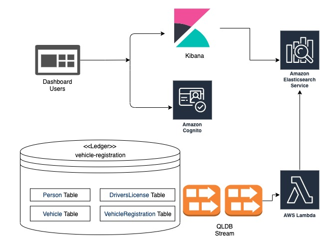

# Amazon QLDB Streams Elasticsearch Integration Sample


The sample in this project demonstrates how to integrate [Amazon Elasticsearch Service](https://aws.amazon.com/elasticsearch-service/) with [Amazon QLDB](https://aws.amazon.com/qldb/) using Streams.
It consists of a AWS Lambda function written in Python which reads QLDB Streams and indexes documents to Amazon Elasticsearch.
This sample is modelled around a department of motor vehicles (DMV) database that tracks the complete historical information about vehicle registrations.


## What does this sample application do ?

The Sample demonstrates how you can replicate your documents in Amazon QLDB to Amazon Elasticsearch Service in near real time using [Amazon Kinesis](https://aws.amazon.com/kinesis/).

##### The following AWS technologies have been used: 

* [AWS Lambda](https://aws.amazon.com/lambda/)
* [Amazon Kinesis Data Streams](https://aws.amazon.com/kinesis/data-streams/)
* [Amazon Elasticsearch Service](https://aws.amazon.com/elasticsearch-service/)
* [AWS Cognito](https://aws.amazon.com/cognito/)
* [AWS SAM](https://aws.amazon.com/serverless/sam/)
* [AWS CloudFormation](https://aws.amazon.com/cloudformation/)


##### What happens in the Sample: 
* QLDB captures every document revision that is committed to your journal and delivers this data to Amazon Kinesis Data Streams in near-real time. 
* Amazon Kinesis Data Streams triggers AWS Lambda for each batch of Stream Records.
* The Lambda function indexes the documents to Elasticsearch. It indexes `Person` documents for only `insert` cases in QLDB and indexes `VehicleRegistration` for `insert and update` cases.
* To view the documents you can login to the Kibana Dashboard. The endpoint is authenticated using AWS Cognito. You will be required to create a user and a temporary password to access Kibana Dashboard. This will be covered in the setup steps.
* The sample includes Python scripts inside folder `sample_scenarios` to `insert, update and delete` data into the QLDB tables. 


## Requirements


### SAM CLI

[AWS SAM](https://aws.amazon.com/serverless/sam/) provides you with a command line tool, the AWS SAM CLI, that makes it easy for you to create and manage serverless applications. You need to install and configure a few things in order to use the AWS SAM CLI. See [AWS SAM CLI Installation](https://docs.aws.amazon.com/serverless-application-model/latest/developerguide/serverless-sam-cli-install.html) for details.

### AWS CLI

SAM requires an S3 bucket to host the source code for lambda function. We will be using the AWS CLI for creating the bucket. Please read [AWS CLI Configuration](https://docs.aws.amazon.com/cli/latest/userguide/cli-chap-configure.html#cli-quick-configuration) for help on how to configure the CLI. 

### Python 3.x

The examples require Python 3.x. Please see the link below for more detail to install Python 3.x:

* [Python 3.x Installation](https://www.python.org/downloads/)

## Setting up the Sample

It is required that you clone this repository. The project consists of two main directories:

* `src` : This directory has the source for the Lambda function.
* `sample_scenarios` : This consists of python scripts which can be used to insert, update and delete documents in `vehicle-registration`. These will be used after setup is complete to verify that the sample works as expected. 

##### 1. Create a ledger named `vehicle-registration`
  
	Please Follow the steps listed [here](https://docs.aws.amazon.com/qldb/latest/developerguide/getting-started-step-1.html) to create a new Ledger.
     


##### 2. Create an S3 bucket

We would need to create an S3 bucket. This S3 bucket would be used by SAM to host the source code of the lambda function.

```
export BUCKET_NAME=some_unique_valid_bucket_name
aws s3 mb s3://$BUCKET_NAME
```

##### 3. Run the following command in the root of the directory to build the source code and generate deployment artifacts.

```
sam build
```

##### 4. Package the lambda function to S3

```
sam package \
    --output-template-file packaged.yaml \
    --s3-bucket $BUCKET_NAME
```

##### 5. Deploy the lambda stack

```
sam deploy \
    --template-file packaged.yaml \
    --stack-name STACK_NAME \
    --capabilities CAPABILITY_NAMED_IAM \
  	--parameter-overrides ParameterKey=ElasticsearchDomainName,ParameterValue=DOMAIN_NAME
    
```
*Replace `DOMAIN_NAME` with a domain name of your choice*

*Replace `STACK_NAME` with a stack name of your choice*

*Note: After the deployment completes, you should see `KibanaEndpoint` in the outputs. Please copy this, we will need it later.*

The Deployment will create a Cloudformation Stack with name you specify in the deploy command. As part of the Stack, Cloudformation will create the following:
* Create some IAM Roles. The Roles would be used by Lambda, Kinesis and Cognito.
* Create an AWS Lambda function. The function would be responsible for parsing Stream Records, creating JSON documents and indexing/deleting them on Amazon Elasticsearch.
* Create an Elasticsearch domain. 
* Create an AWS Cognito User Pool and Identity Pool
* Create indexes `person_index` and `vehicle_index` on Elasticsearch using [Custom Resource](https://docs.aws.amazon.com/AWSCloudFormation/latest/UserGuide/template-custom-resources.html).

##### 6. Create QLDB Stream

- Sign in to the AWS Management Console, and open the Amazon QLDB console at https://console.aws.amazon.com/qldb.

- In the navigation pane, choose Streams.

- Choose Create QLDB stream.

- On the Create QLDB stream page, enter the following settings:

  - Ledger – Select the ledger `vehicle-registration` from the drop down.

  - Start date and time – Leave this as the default. The default is current time.

  - End date and time – This can be left blank

  - Destination stream for journal data – Click browse and select   
`RegistrationStreamKinesis`.

  - Enable record aggregation in Kinesis Data Streams – Enables QLDB to publish multiple stream records in a single Kinesis Data Streams record. To learn more, see KPL Key Concepts.

  - IAM role – Select `RegistrationStreamsKinesisRole` from the dropdown

 - When the settings are as you want them, choose Create QLDB stream.

 - If your request submission is successful, the console returns to the main Streams page and lists your QLDB streams with their current status.


##### 7. Create a user and a temporary password for Kibana Dashboard.
- Go to [AWS Cognito Console](https://console.aws.amazon.com/cognito/home)
- Click on `Manage User Pools`
- Click on `registrations_kibana_demo_userpool` 
- Click on `Users and groups` and click `Create user`
- In the `Create user popup` :
  - Enter a username in `Username` field. (This will be needed later)
  - Enter a temporary password in `Password` field. (This will be needed later)
  - Uncheck all checkboxes
  - Click `Create user` button

##### 8. Verify if Elasticsearch setup is ready
- Open the Kibana Endpoint you copied in step 5. 
- If you get a login dialog box, you are good to go.
- If you get an unauthorized access error, then probably the Elasticsearch intialization has not finished. It usually takes 15 minutes. Check the status on [AWS Elasticsearch Console](https://console.aws.amazon.com/es/home).


##### 9. Login to Kibana. If you are doing it for the first time, it should ask you to reset the password.

##### 10. Follow these [steps](https://docs.aws.amazon.com/qldb/latest/developerguide/getting-started-step-2.html) to load Sample Data into the ledger.
  
##### 11. Create index pattern on kibana - `person_index`, `vehicle_index`
  
    Check [here](https://www.elastic.co/guide/en/kibana/current/tutorial-define-index.html) on how to create index patterns on Kibana.
    
You should see some documents for `person_index` and `vehicle_index`.    
    


## Running Sample Scenarios

Here we will insert and update some documents in QLDB and verify that those updates reflect on Elasticsearch.

##### Install dependencies required to run sample scenarios tasks.

Run the following command in the root of the repository.

```
pip install -r sample_scenarios/requirements.txt
```

*Note: In case your Ledger name is not `vehicle-registration`, you will have to update the 
ledger name in `sample_scenarios/constants.py`*

##### Scenario 1: Insert some documents

We will insert some more documents to the tables in the ledger and verify insertions in Elasticsearch.

```
python -m sample_scenarios.insert_documents
```

##### Scenario 2: Update some documents

We will update `PendingPenaltyTicketAmount` for some documents in the `VehicleRegistration` table.
The updates should reflect on Elasticsearch.

```
python -m sample_scenarios.single_update_to_document
```

##### Scenario 3: Update some documents

We will update `PendingPenaltyTicketAmount` multiple times for a document in the `VehicleRegistration` table.
The final update should reflect on Elasticsearch.

```
python -m sample_scenarios.multiple_updates_to_a_document
```

## Note

* This sample does not place the Elasticsearch domain in a VPC for the sake of simplicity. Refer [here](https://docs.aws.amazon.com/elasticsearch-service/latest/developerguide/es-vpc.html) in case it is required.
* You might want to change configurations of the Elasticsearch domain. Configurations such as availability zones, instance size, storage size highly depends on requirements. Refer [here](https://docs.aws.amazon.com/elasticsearch-service/latest/developerguide/es-createupdatedomains.html#es-createdomains) for more details. 


## Unit Tests

Tests are defined in the `tests` folder in this project. Use PIP to install the [pytest](https://docs.pytest.org/en/latest/) and run unit tests.

```bash
pip install pytest pytest-mock --user
python -m pytest tests/ -v
```

## Cleanup

To delete the sample application that you created, use the AWS CLI. Assuming you used your project name for the stack name, you can run the following:

```bash
aws cloudformation delete-stack --stack-name STACK_NAME
```

## License

This library is licensed under the MIT-0 License.
